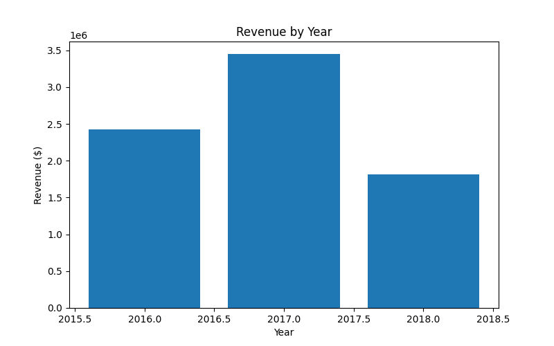
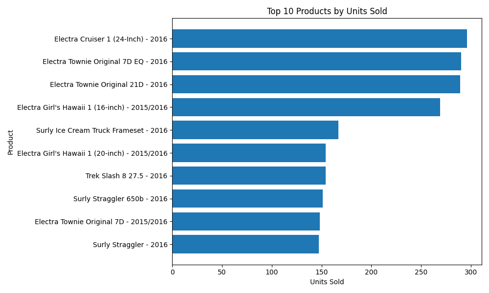

# 🚲 BikeStore Analytics — BikeStores Relational Database

## 📌 Project Overview

This project analyzes the **BikeStores relational database** using **PostgreSQL + Python**.
Original dataset: [Bike Store Database on Kaggle](https://www.kaggle.com/datasets/ahmedabbas757/bike-store-database)  


* Database design and SQL queries
* Data import & cleaning (ETL)
* Python integration with PostgreSQL
* Data visualization (matplotlib)

The dataset contains information about products, brands, categories, customers, orders, staffs, and stores.

---

## 🏢 Company (Fictional)

**BikeStore Analytics** is a data analytics team supporting a bike retail chain in Kazakhstan & Central Asia.
We help management understand sales, customer behavior, and inventory through database-driven insights.

---

## 📂 Project Contents

* `main.py` → Python script to connect to PostgreSQL, run queries, export CSVs, and generate plots
* `queries.sql` → SQL file with basic checks and 10 analytical queries
* `bikestore_dataset.csv` → Flattened dataset (orders + products + customers + stores)
* `/outputs/` → Folder containing exported CSVs & plots

  * `customers_sample.csv`
  * `revenue_by_year.csv`
  * `top_products.csv`
  * `revenue_by_store.csv`
  * `revenue_by_year.png`
  * `top_products.png`
* `README.md` → this file

---

## ⚙️ Setup Instructions

### 1. Database Setup

1. Install **PostgreSQL** (v15/16 recommended).
2. Create a database:

   ```sql
   CREATE DATABASE bikestore;
   ```
3. Create schemas and tables (see schema.sql if needed).
4. Import CSVs into tables (via `psql \copy` or pgAdmin Import Tool).

Tables:

* `production.brands`
* `production.categories`
* `production.products`
* `production.stocks`
* `sales.customers`
* `sales.stores`
* `sales.staffs`
* `sales.orders`
* `sales.order_items`

### 2. Python Environment

```bash
pip install psycopg2-binary matplotlib
```

### 3. Run the Script

```bash
python main.py
```

Exports will appear in the `/outputs` folder.
Main dataset will be saved as `bikestore_dataset.csv`.

---

## 📊 Example Visualizations

### Revenue by Year



### Top 10 Products



---

## 📑 SQL Analysis Topics

Queries in `queries.sql` cover:

1. Basic select with limit
2. Filtering + sorting
3. Aggregation with `GROUP BY`
4. Join example
5. Sales by month
6. Top products by units sold
7. Revenue by store
8. Average order value
9. Staff performance (orders handled & revenue)
10. Repeat customers
11. Inventory stock levels
12. Revenue by brand & category

---

## ✅ Deliverables

* PostgreSQL schema + data
* SQL queries (`queries.sql`)
* Python integration (`main.py`)
* CSV dataset (`bikestore_dataset.csv`)
* Visualizations (PNG plots)
* Documentation (`README.md`)

---

## 📌 Notes

* This repo is public for academic evaluation.
* Dataset is from the **BikeStores sample database** (Kaggle / SQL Server tutorial).
* Company name “BikeStore Analytics” is fictional.

---
